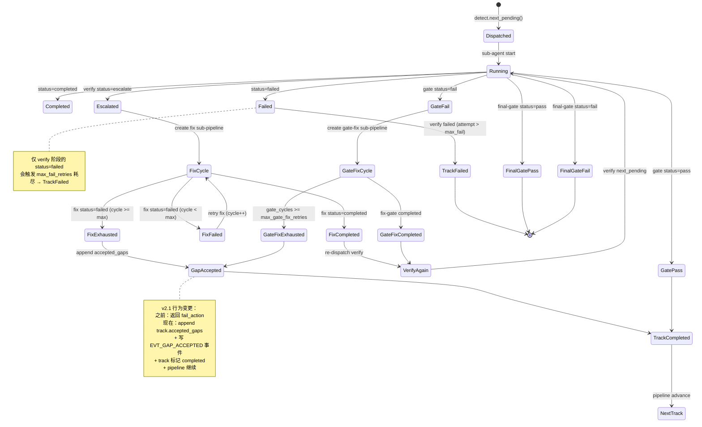

# pg-build-v2 fix/gate-fix 循环协议（v2.1）

本文档定义 pg-build-v2 中 sub-agent 循环的状态机协议。reducer 实现必须严格遵循此图。

## 协议约束

| 循环类型 | 最大次数 | 来源 | 耗尽后行为 |
|---------|---------|------|----------|
| fix | `TrackState.max_fix_retries` (默认 5) | verify escalate 触发 | **accept_gap** → track 标 completed |
| gate-fix | `TrackState.max_gate_fix_retries` (默认 2) | gate fail 触发 | **accept_gap** → track 标 completed |

`accept_gap` 协议：
- reducer 写入 `track.accepted_gaps`（tuple 追加）
- orchestrator 检测 `accepted_gaps` 长度增量，写 `EVT_GAP_ACCEPTED` 事件
- track 状态改为 `completed`，pipeline 继续推进

## 状态机

## 关键函数

| 函数 | 位置 | 职责 |
|------|------|------|
| `reducer._handle_fix` | `pipeline/reducer.py` | 处理 fix phase 的 completed/failed |
| `reducer._handle_fix_gate` | `pipeline/reducer.py` | 处理 fix-gate phase 的 completed/failed |
| `reducer._handle_gate` | `pipeline/reducer.py` | 处理 gate phase 的 pass/fail（含耗尽 → accept_gap） |
| `reducer._make_gap_entry` | `pipeline/reducer.py` | 构造 accepted_gaps 条目 |
| `orchestrator.record` | `pipeline/orchestrator.py` | 检测 accepted_gaps 增量，写 EVT_GAP_ACCEPTED |
| `events.EVT_GAP_ACCEPTED` | `pipeline/events.py` | 事件常量 |

## v2.0 → v2.1 行为变更

| 场景 | v2.0 行为 | v2.1 行为 |
|------|----------|----------|
| fix 循环耗尽 | 返回 `fail_action`，workflow failed | `accept_gap` + advance，pipeline 继续 |
| gate-fix 循环耗尽 | 返回 `fail_action` | `accept_gap` + advance |
| 接受的 gap 持久化 | 无（只在 reducer 内存） | `track.accepted_gaps` tuple + 事件流 |
| audit trail | 不可见 | `EVT_GAP_ACCEPTED` 事件可被 replay 重放 |

## 受影响测试

- `tests/test_reducer.py::TestGateFailExhausted` — 新增 `test_gate_fail_exhausted_accepts_gap`
- `tests/test_reducer.py::TestFixStatusFailed` — `test_fix_status_failed_exhausted_creates_fail_action` 改为 `test_fix_status_failed_exhausted_accepts_gap`