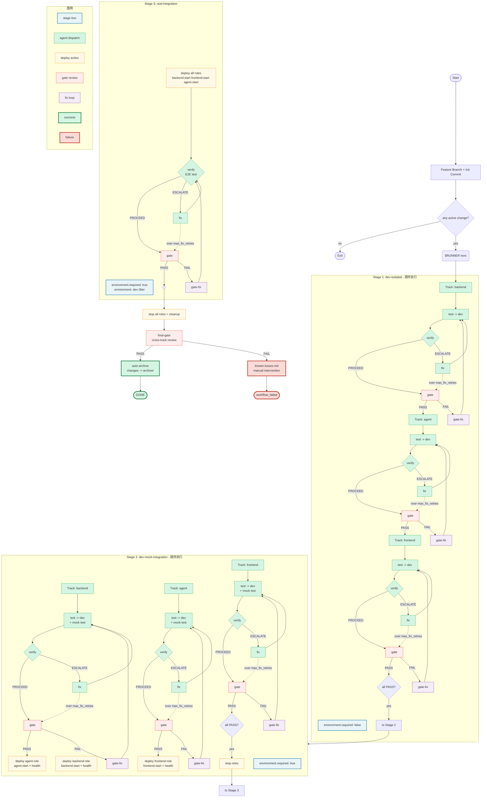

# pg-build 流程图



## 说明

### 三种 stage 的区别

| 维度 | dev-isolated | dev-mock-integration | real-integration |
|------|-------------|---------------------|-----------------|
| deployment | 不启动 | 每个 track 前启自己 role | 启全部 role |
| 测试范围 | unit test | mock_integration test | real_integration test |
| 执行方式 | 顺序：backend → agent → frontend | 顺序：backend → agent → frontend | 单个 track |
| fix_routing | source（本 track 内修） | source | auto（按 diff 跳到对应 track） |

### 执行顺序

所有 stage 内的 track **顺序执行**（非并发）：

```
Stage 1  → backend TDV → agent TDV → frontend TDV → gate all_pass → Stage 2
Stage 2  → deploy backend → backend TDV → deploy agent → agent TDV → deploy frontend → frontend TDV → stop → Stage 3
Stage 3  → deploy all → verify E2E → gate → stop → final-gate
```

### TDV 循环（每 track）

```
test → dev → verify → 通过 → gate → PASS → 下一 track
                   └→ 失败 → fix → re-verify → ... (max_fix_retries)
                                                └→ 超限 → gate (强制)
```

### 环境启动

仅 `environment.required=true` 的 stage 会调 `role.actions.start`，结束后调 `role.actions.stop`。