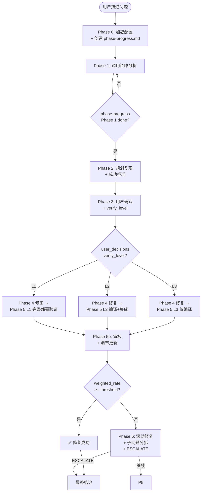

# pg-fix-issue-v2

> **v2 独立设计，与 v3.0/v3.1 不兼容**。解决 v1 SKILL 的核心问题：
> - SKILL 太长被截断 → 主入口 ~400 行 + 按需 include 子文档
> - 部署门控无降级 → L1/L2/L3 三档分级验证
> - 进度丢失风险 → phase-progress.md 文件化
> - 问题瀑布隐式 → 显式 waterfall + 达成度判定
> - 完成判定二元 → completion_rate + 阈值
> - 子问题无机制 → auto_split 自动创建子 session
> - 防御性内容冗长 → 全移 reference/anti-patterns.md

## 0. 流程总览



## 1. 核心思想

| 设计 | 说明 |
|------|------|
| **分层验证** | L1/L2/L3 三档，用户在 Phase 3 显式选 |
| **进度文件化** | phase-progress.md 是唯一真相源 |
| **问题瀑布** | 显式追踪 + 达成度判定 + 子问题分拆 |
| **核心动作置顶** | 每个 phase 的「必做」步骤用 [ ] checkbox |
| **防御性内容移附录** | 主流程只讲「该做什么」 |
| **强制终止** | 5 个强制条件避免无限循环 |

## 2. Phase 流程（必做动作清单）

### Phase 0: 加载配置

- [ ] S0-1: `pg-parse-config.py pg-fix-issue`
- [ ] S0-2: 反查 affected_tracks
- [ ] S0-3: 创建 `.pg/fix-issue/<session>/phase-progress.md`
- [ ] S0-4: 初始化 waterfall（P-1 = 用户原始问题）

详见 `phases/phase-0.md`

### Phase 1: 调用链路分析

- [ ] S1-1: 更新 phase-progress.md current_phase=1
- [ ] S1-2: 派遣 explore subagent
- [ ] S1-3: 影响半径扫描
- [ ] S1-4: 输出 `call-chain.md`
- [ ] S1-5: 更新 phase-progress.md phases[1].status=completed

详见 `phases/phase-1.md`

### Phase 2: 规划

- [ ] S2-2: reproduction_steps ≥3 步
- [ ] S2-3: success_criteria ≥1 条（含 SC-FORCE-1）
- [ ] S2-4: failure_criteria ≥1 条
- [ ] S2-5: 输出 `phase2.md`

详见 `phases/phase-2.md`

### Phase 3: 用户确认

- [ ] S3-2: question 复现步骤 + 成功标准
- [ ] S3-3: question 环境选择
- [ ] S3-4: question verify_level 选择（**L1/L2/L3**）
- [ ] S3-5: question 达成度阈值（**0.8/0.9/1.0**）
- [ ] S3-6: question 子问题策略（**auto_split/in_session/known_issues**）
- [ ] S3-7: question prepare_env 时机
- [ ] S3-8: question clean_env 时机
- [ ] S3-9: 写入 phase-progress.md user_decisions

详见 `phases/phase-3.md`

### Phase 4: 修复

- [ ] S4-2: （可选）TDD 写失败测试
- [ ] S4-4: Edit/Write 改代码
- [ ] S4-5: 编译 + 单元测试
- [ ] S4-6: 更新 files_changed

详见 `phases/phase-4.md`

### Phase 5: 验证（按 verify_level 分支）

| verify_level | 必做序列 |
|--------------|---------|
| **L1** | invoke-hook start → api_call → log_filter → unit test |
| **L2** | mvn compile → integration test → DB schema check |
| **L3** | mvn compile → lint → unit test |

详见 `phases/phase-5.md` + `reference/verify-levels.md`

### Phase 5b: 审核 + 瀑布更新

- [ ] S5b-1: executor 伪造检测
- [ ] S5b-2: 逐项检查 success_criteria
- [ ] S5b-3: 逐项检查 failure_criteria
- [ ] S5b-4: 更新 waterfall（暴露新问题 + 标记已修）
- [ ] S5b-5: 重算 completion_metrics
- [ ] S5b-6: 强制终止检测
- [ ] S5b-7: 写入 iter-N.json

详见 `phases/phase-5b.md`

### Phase 5c+d: 架构验证 + 清理

- [ ] 5c: 修复遵循 API scope / 安全 / 协议
- [ ] 5d: 撤 DIAG 日志 / git diff 干净

详见 `phases/phase-5cd.md`

### Phase 6: 失败处理 / 子问题分拆

```
iteration 完成后:
  ├── weighted_rate >= threshold → ✅ 修复成功
  ├── weighted_rate < threshold 且未达 max → ⚠️ 继续 iteration
  ├── 触发分拆条件 → 🔀 子问题分拆
  └── iteration_count > max 或强制终止 → ESCALATE_WITH_MENU
```

详见 `phases/phase-6.md` + `reference/waterfall-rules.md`

## 3. 文档结构

```
.opencode/skills/pg-fix-issue-v2/
├── SKILL.md                      # 本文件
├── shared.md                     # 共享协议（executor / invoke-hook）
├── phases/
│   ├── phase-0.md                # 加载配置
│   ├── phase-1.md                # 调用链路分析
│   ├── phase-2.md                # 规划复现 + 成功标准
│   ├── phase-3.md                # 用户确认
│   ├── phase-4.md                # 修复
│   ├── phase-5.md                # 验证（按 verify_level）
│   ├── phase-5b.md               # 审核 + 瀑布更新
│   ├── phase-5cd.md              # 架构验证 + 清理
│   └── phase-6.md                # 失败处理 / 滚动 / 分拆
├── templates/
│   ├── phase-progress.md         # 进度文件模板
│   ├── success-criteria.md       # 成功/失败标准模板
│   └── final-report.md           # 最终结论模板
└── reference/
    ├── verify-levels.md          # L1/L2/L3 详细定义
    ├── waterfall-rules.md        # 问题瀑布管理规则
    └── anti-patterns.md          # 禁用模式
```

## 4. 与 v1 的关键差异

| 维度 | v1 | v2 |
|------|----|----|
| 文档长度 | 1307 行（被截断）| ~400 行主入口 + 9 子文档 |
| 部署验证 | 必须 invoke-hook | L1/L2/L3 三档 |
| 进度追踪 | 仅 conversation | phase-progress.md |
| 问题瀑布 | 隐式 | waterfall 表 |
| 完成判定 | 二元 | weighted_rate + 阈值 |
| 子问题 | 必须一起修 | auto_split 子 session |
| 强制终止 | 无 | 5 个条件 |
| 会话恢复 | 无 | phase-progress.md |
| 接口兼容性 | 旧调用方式 | v2 独立设计 |
| 防御性内容 | 占主流程 60% | 全移 reference |

## 5. 配置

读取 `.pg/project.yaml` 的 `fix_issue` 段：

```yaml
fix_issue:
  # v1 字段
  max_iteration_count: 5
  partial_success_threshold: 0.7
  
  # v2 新增字段
  default_verify_level: L1
  default_completion_threshold: 0.8
  default_sub_problem_strategy: auto_split
  sub_problem_split_trigger:
    min_exposed_problems: 3
    max_completion_rate: 0.5
  termination_conditions:
    rate_stagnant_iterations: 2
    net_regression_max: 0
    problem_explosion_threshold: 10
    same_root_cause_threshold: 3
```

## 6. 调用入口

```
用户描述问题
    ↓
[skill: pg-fix-issue-v2]
    ↓
Phase 0 → 1 → 2 → 3 → 4 → 5 → 5b → 5c+d → 最终结论
```

## 附录

- `reference/verify-levels.md` - L1/L2/L3 详细定义
- `reference/waterfall-rules.md` - 问题瀑布管理规则
- `reference/anti-patterns.md` - 禁用模式速查
- `templates/phase-progress.md` - 进度文件完整模板
- `templates/final-report.md` - 最终结论完整模板
- `templates/success-criteria.md` - 成功标准模板
- `shared.md` - 与 pg-build 共享协议

> **与 v3.0/v3.1 不兼容**：v2 SKILL 独立存在，不保证与 v1 调用方式兼容。v2 不会取代 v1，但推荐新项目使用 v2。